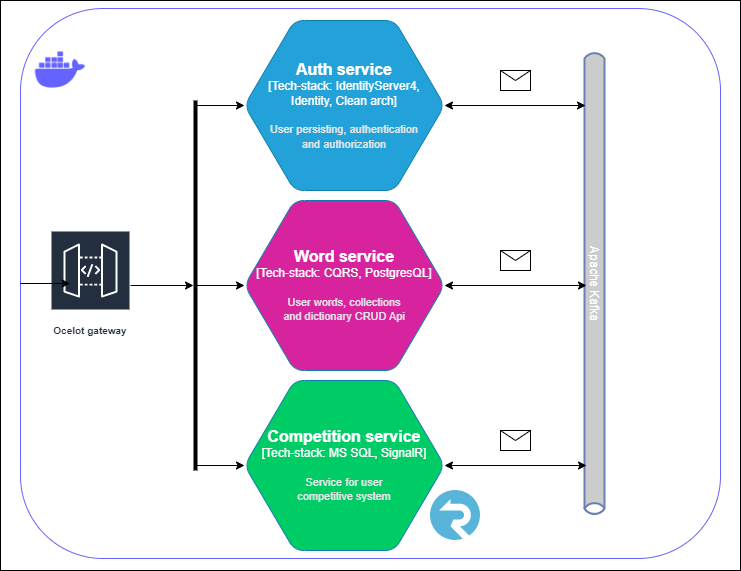

# helloWorldOnContainers
### Run `docker compose up` in the `src` folder to run application 

### Services:
* Identity,
* Words,
* Achievements.

### Features:
* JWT Authentication
* Policy-based authorization
* Interservice interaction using **RabbitMQ** message broker
* API gateway using **Ocelot**
* Entities mapping using **Mapster**
* Caching using **Redis**
* Unit testing with **NUnit**, **Moq** and **FluentAssertions**
* CQRS pattern using **MediatR**
* Clean Architecture
* 3-Tier architecture
* Unit of Work and Repository patterns implementation
* Swagger documentation
* Backing services with **Quartz**
* Structured logging with **Serilog** and **Seq**
* WebSocket communication using **SignalR**
* Validation with **FluentValidation**
* CI pipeline using **GitHub Actions**

### Technologies:
* [ASP.NET Core 7.0](https://dotnet.microsoft.com/en-us/)
* [Entity Framework Core](https://learn.microsoft.com/en-us/ef/core/)
* [Identity Server 4](https://identityserver4.readthedocs.io/en/latest/)
* [SignalR](https://learn.microsoft.com/en-us/aspnet/signalr/overview/getting-started/introduction-to-signalr)
* [MediatR](https://github.com/jbogard/MediatR)
* [FluentValidation](https://docs.fluentvalidation.net/en/latest/)
* [NUnit](https://nunit.org/)
* [Moq](https://www.nuget.org/packages/Moq)
* [FluentAssertions](https://fluentassertions.com/)
* [Ocelot](https://github.com/ThreeMammals/Ocelot)
* [RabbitMQ](https://www.rabbitmq.com/)
* [Swagger](https://learn.microsoft.com/en-us/aspnet/core/tutorials/web-api-help-pages-using-swagger?view=aspnetcore-7.0)
* [Quartz](https://www.quartz-scheduler.net/)
* [Serilog](https://serilog.net/)
* [Seq](https://datalust.co/seq)
* [Redis](https://redis.io/)
* [Mapster](https://github.com/MapsterMapper/Mapster)

### Application scheme 

